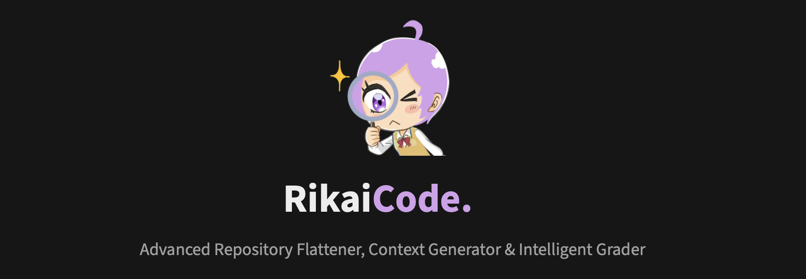
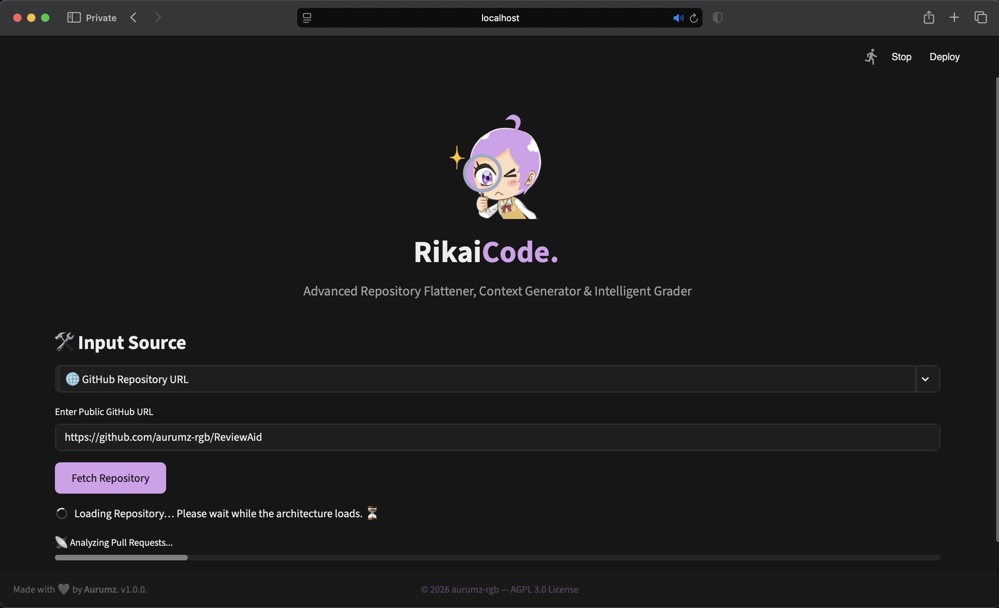
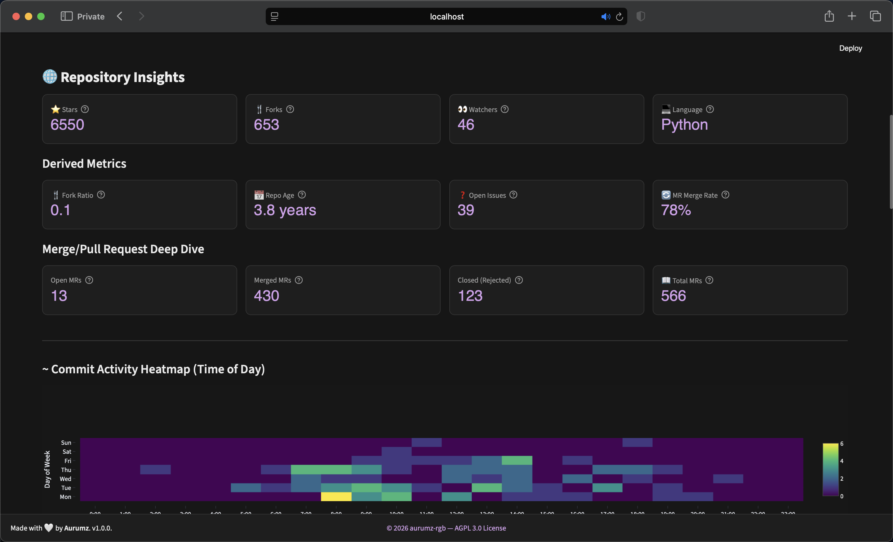
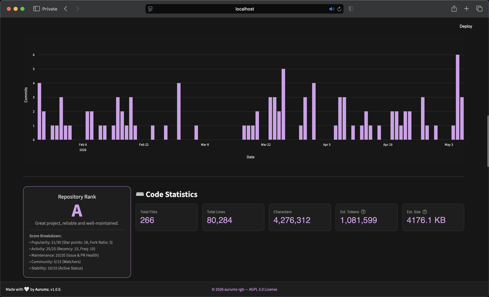
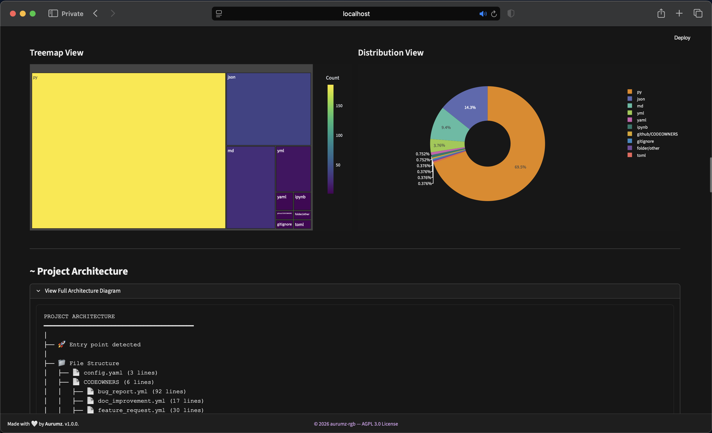
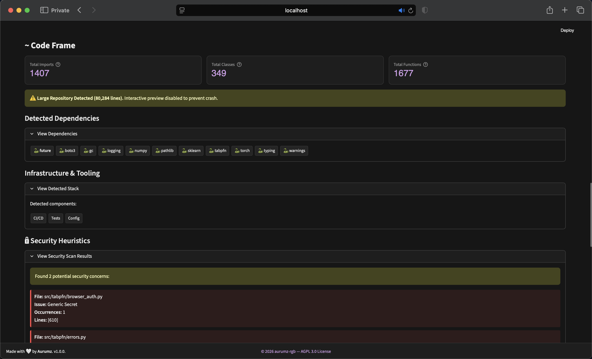
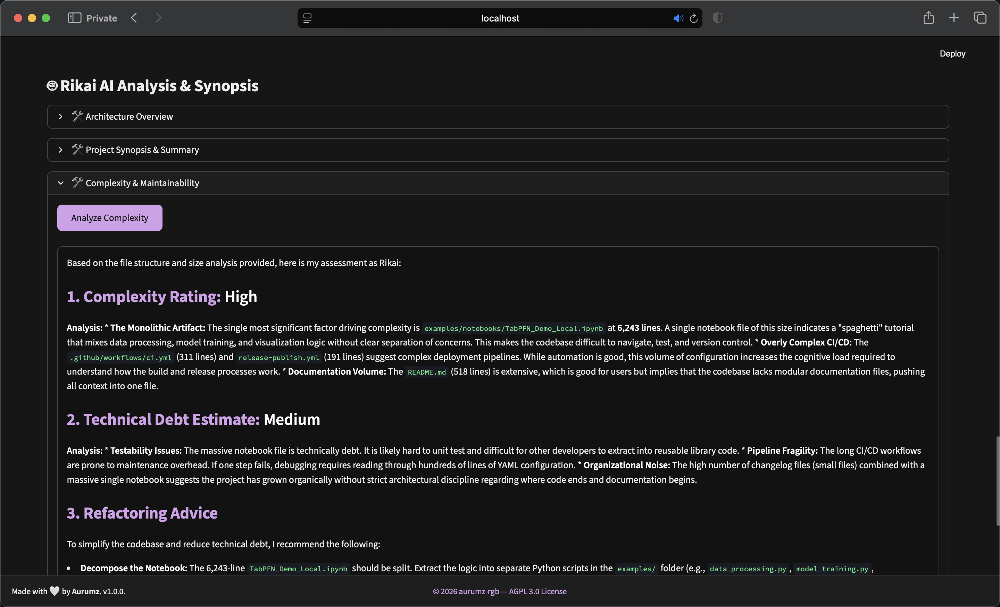
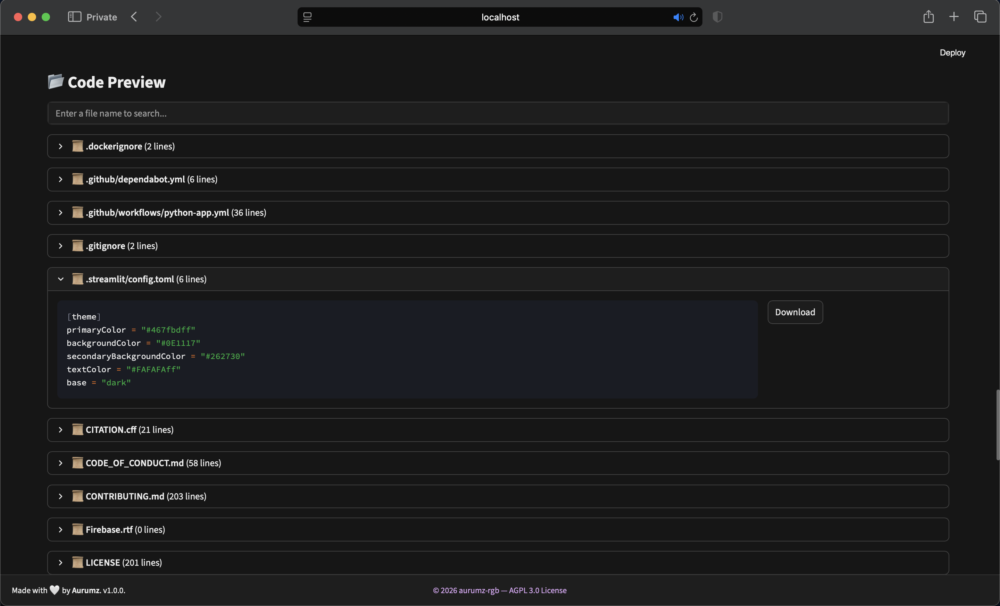

*Flattening for AI, Context for understanding, and Grading for quality.*

RikaiCode is a sophisticated, browser-based tool designed to turn complex codebases into structured, actionable data. Whether you need to feed code into an LLM, audit a project's quality, or simply understand a new architecture, RikaiCode provides the insights you need in a beautiful, dark-themed interface.

* Please visit the main repository for details: https://github.com/aurumz-rgb/RikaiCode

---
 
 
 
 
 

*AI-generated architecture summary / code review and Repository code Flattener.* 
 
 

